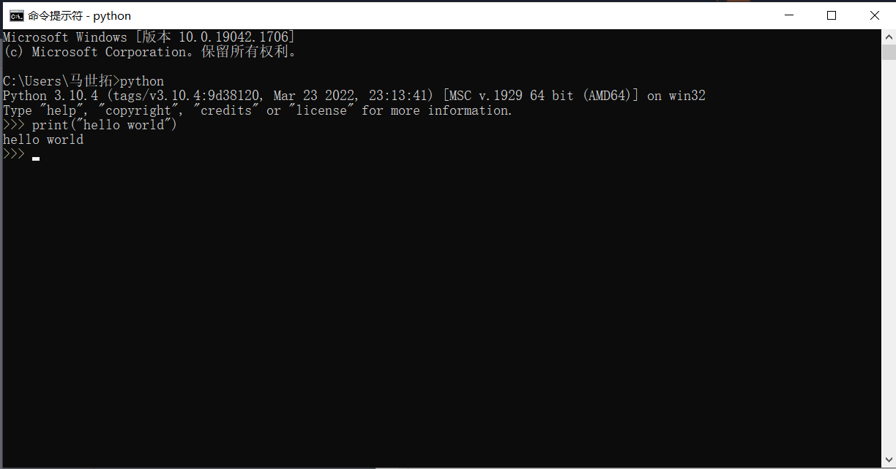

# 数学建模导论：基于python语言（2022秋）

#### 介绍
本实验是《数学建模导论：基于Python语言》的配套实验内容，马马将在这次实验中带大家一步步从小白到竞赛实战，让数学建模不再是一项可怕的竞赛。

## Python环境的安装
在开始实验之前，大家可以先去anaconda官网安装python大礼包：www.anaconda.com

当然如果想安装原生Python也可以直接上python官网：www.python.org

但是Python如果是原生状态下的话里面啥都没有，所以如果碰到了库不存在的话，将命令行打开，键入pip install ****能够解决大多数问题。

如果觉得编程环境不好用的话可以加装一个VSCode或者Pycharm，但是华科的学生装正版Pycharm可能还有一点点问题因为学校邮箱出了点事。

## 实验一：Python的基础语法

本次实验的基本目的是熟悉Python的基础语法。首先我们可以打开命令行（windows用户可以在cortana中键入cmd，会弹出命令提示符），然后键入python回车就可以切换到python命令行模式了。这一模式下我们可以试试它的hello world和C的hello world有多大差距：

可以看到Python的hello world仅需要一行。但是在更多情况下，我们和C一样会在文本文件中写程序然后运行。

这一次实验我们的目的就是熟悉基本的控制流和集合等内容。

### 1. 熟悉Python的输入输出操作，并实现对一个输入序列的冒泡排序
现在对计算机1915班的前五名同学模电成绩想排个序，要求：

- 输入成绩个数为5，用input()函数实现
- 将输入的五个数保存成列表，并进行冒泡排序
- 不允许使用list自带的sort()方法，必须自己设置冒泡排序
- 将五个数排序后的结果排成一行输出到控制台

### 2. 分支语句判断
现在马马考完了模电，老师想在控制台里面根据我的成绩评价我的学习水平，要求：

- 控制台输入马马的模电分数
- 如果分数高于95，输出“马马+是卷王”；如果在80-95之间，输出“马马+牛牛”；如果在60-80之间，输出“马马+摆烂了”；如果低于60，输出“马马+老师，你不会又得重修了吧”
- 异常处理：如果分数是一个小于零的数或者输入的根本就不是数字如何handle？

### 3. 循环语句
老师手里有一份光之国模电考试的成绩单，保存成了txt文件，每一行分别是班里同学的名字和分数。现在需要：

- 利用open和read函数循环读取每一行，将结果保存到字典中
- 首先输出杰克、雷欧和贝利亚的模电成绩，如果检索不到人名需要报警“找不到这位同学”
- 然后循环遍历这个字典，对于每个同学的模电成绩按照第二关中的操作输出这位同学的状态

### 4. 函数编写
试着将第三关的语句改写为一个函数，函数参数为成绩单文件的路径与文件名。

## 实验二：Python规划求解

## 实验三：Python微分方程建模

## 实验四：鸢尾花的数据预处理与可视化

## 实验五：产品的多维度评价

## 实验六：比特币价格预测

## 实验七：最短路径问题

## 实验八：量化投资选股问题

## 实验九：鸢尾花的分类与聚类

## 实验十： 波士顿房价预测

## 实验十一：34城市的TSP问题

## 实验十二：关联关系挖掘
